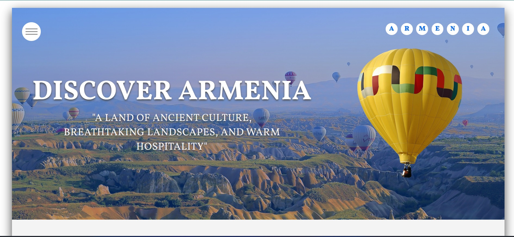
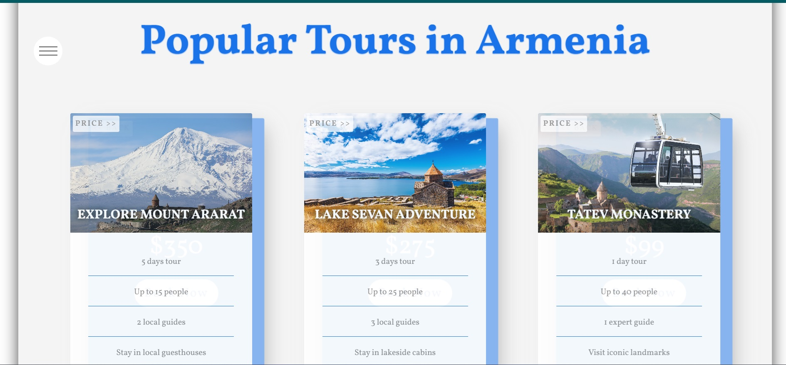

# My Travel Agency Website

This project is a static travel agency website showcasing tours, customer stories, and a contact section. It is built using HTML, CSS, and JavaScript with a responsive design and smooth animations.

## Features

- **Responsive Layout**: Compatible with desktop, tablet, and mobile.
- **Interactive Navbar**: A sliding navbar with smooth transitions.
- **Popular Tours**: Animated tour cards.
- **Customer Stories**: Testimonial section with background video.
- **Contact Form**: Functional form with validation.

## Technologies Used

- **HTML5**: Structure of the website.
- **CSS3**: Styling and animations (with optional SCSS).
- **JavaScript**: Interactivity (e.g., navbar toggle).
- **Google Fonts**: `Vollkorn` for typography.
